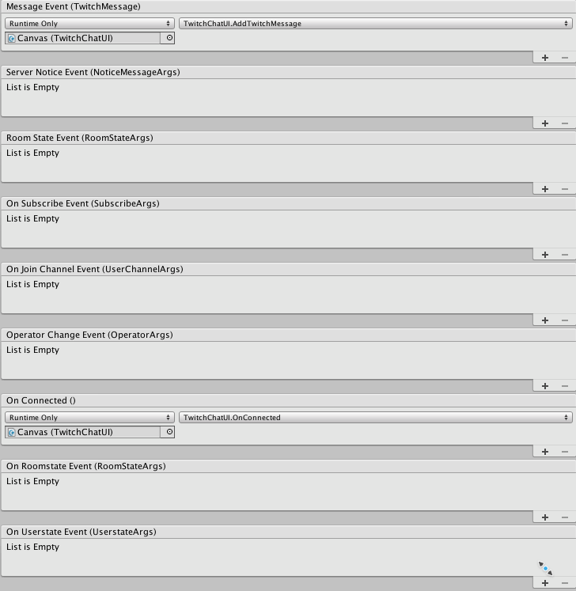

# Quick Start Guide

* Add Twitch Wrapper script to an object in your scene.

* You will then need to supply a list of channels to connect to, an Account to link to and an oauth token

It's possible to retrieve the token through the twitch by using the Get Oauth Token

NOTE: These steps should be used for testing if the twitch integration
portions of your app function correctly, but shouldn't be used in
production. You will have to grab the component during runtime and provide the
appropriate Account, outh, channels and also call connect(). The library will
auto connect on startup if the correct authentication is provided through the
inspector.

* At this stage your app should connect to twitch. You will need to attach to
the selection of events provided by the wrapper for an app to take full
advantage of the library.

